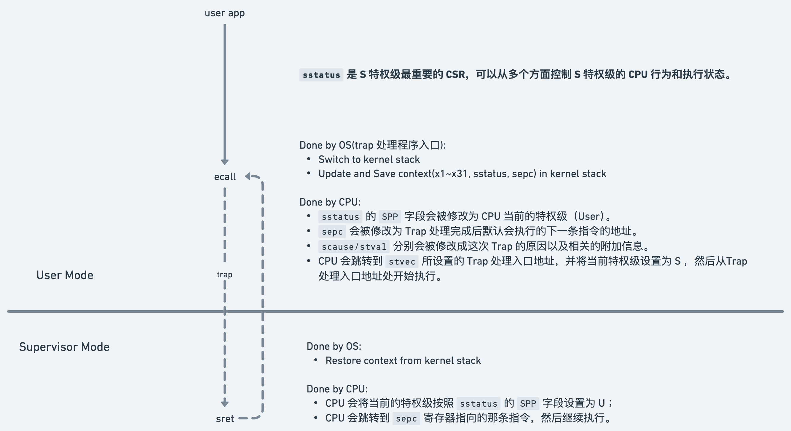

# procos

## Trap flow

### syscall

__alltraps -> trap_handler -> trap_return -> __restore

### run app at the first time

__restore

## Task switch
任何 task 第一次执行的代码都是 trap_return/__restore，用于从内核态跳转到用户态。跳转到用户态后，执行的是 trap context 里的 sepc。sepc 第一次被初始化为程序入口的 entry，后续后被中断处理程序设置为被中断的程序位置。

运行 task 需要构建 task context，里面有个 ra 字段表示 task 切换回来后执行的代码位置，第一次被设置为 trap_return（`TaskContext::init(trap_return as usize, kernel_stack_top)`)。trap_return 是一个函数，目的是执行 __restore。为啥不直接执行 __restore? 因为现在的跳转代码是位于用户态的 trampoline 页，是虚拟内存，需要计算出 __restore 的 va 才能执行。

第一次 task context 里的 ra 会被设置为 trap_return，但后续会被 __switch 函数设置为正确的位置（`sd ra, 0(a0)`, ra 是调用 __switch 函数时，被编译器自动设置的）。__switch 基本跟普通的函数调用一样，唯一的区别是会切换栈和设置 ra 值。

## Trap context vs Task context

- Trap context
  - different modes(user vs kernel/supervisor) --> handled by CPU automatically
  - different stacks(user vs kernel of the same app)
  - different memory spaces(user vs kernel)

- Task context
  - only stack change(different kernel stacks of apps) --> almost similiar to normal function call
